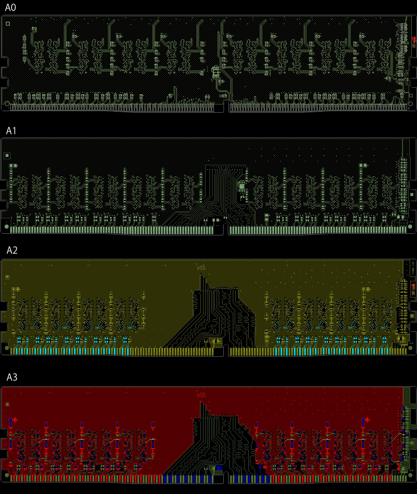
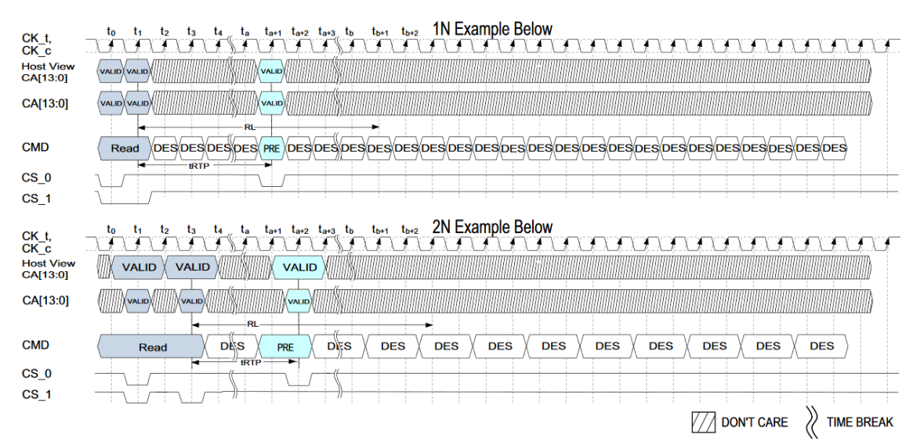
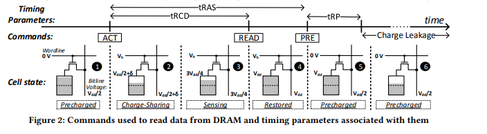

# Why you want to get the lowest latency #
- Why would you want a computer has a delay, why would you want to have a computer has bottlenecks? Forget all other reasons, gaming advantages, why would you want to use a computer slower than its potential?

- Also optimized hardware / software will give you consistent feeling. Its like having a stable ping, if you sometimes have 10 ping, sometimes 70, you will loose it, your rails will not connect, you will always need to adjust your aim, but if you always have 20 ping, it will be consistant and better. It is mostly about consistency, none of these will make you a pro, but you will have consistent environment to play at your best.

- I am not and will never be a tweaker, do not ask, I just love to learn and try these little things that are matter. And this is just my notebook, nothing special, I didnt invent these. There are just information I have gathered from other people and/or papers, lectures. I have only tested, and sharing what worked best.

So here, I will try to give you some information and some sources, sources from my friends to get you started to the journey. And I will try not to comment on anything I havent tried / tested, so feel free to ask further questions.

- [λ my twitter ACC](https://twitter.com/siegerQL)  

**Why latency matters, can you even feel it?**

When people say you cannot feel couple of ms, it is like smaller than a second, you show them this.  And this is only a video, you will feel a lot better. https://www.youtube.com/watch?t=80&v=vOvQCPLkPt4 

Here is a study by nvidia about the corrolation between latency and aim : https://www.nvidia.com/en-us/geforce/news/reflex-low-latency-platform/#why-does-system-latency-matter

***Frames Per Second***

FPS are a meme.
The most important metric is latency. Lower latency results in smoother feeling gameplay. Please stop comparing FPS in games. It is near meaningless.

The only facet of FPS that's releveant is 0.1% minimum fps.

Compare your 0.1% against the delta from your average fps and thats it. The delta means the difference between average fps and your 0.1% fps. The more the gap is, the worse your smoothness will be.

The reason hardware reviewers focus on FPS is because the market is programming you - the consumer -  to only care about frames since they are so easy to inflate. Also these reviewers are not capable of measuring what is important.

Overall, FPS means nothing. You shouldn't about your FPS and instead you should be concerned about your system's latency. You can "cheese" FPS by just increasing "pre rendered frames."  Sure, this will increase your framerate, but at the expense of your games feeling responsive.

The goal is to have the lowest latency and the smoothest gameplay experience so you can dominate your opponents before they even know what happened.

***Latency***

Latency is the time delay between the cause and the effect of some physical change in the system being observed.

An example is the delay between your mouse movements and clicks versus when they appear on your screen.

For the smoothest gameplay, you want consistent FPS with no drops.

**Here are some important tips for low latency hardware**

**CPU**
- As of right now [5/3/21] Intel is the way for any serious gamer, and this is because the architecture allows for lower ram latencies.

- Try to get best intel possible with no disabled cores. The 10900kf(https://amzn.to/3gZMGuQ) is the obvious choice for now.

To explain the "no disabled cores," the 10850k is a failed 10900k, and the 10700k is an even more failed 10900k. The 10700k also has 2 of its cores disabled, which causes latency as well. Because the information has to jump over these disabled cores.

-  When overclocking your cpu, the goal is to have your Core equal to your Uncore (core/ring or core/uncore, they are all the same thing.)
Next, make sure to disable all power saving features
.  Power saving features put the CPU aka CPU C-States
.  Memory States
.  PCI-e states

This link by intel explains it 
https://software.intel.com/content/www/us/en/develop/articles/optimizing-computer-applications-for-latency-part-2-tuning-applications.html

- Make sure to choose your LLC.
Use Flatine LLC.  It has the lowest delay.  Aim for smallest delta.
You will need oscilloscope to measure the instant drops.  Hwinfo is able to show you the ups and downs but not split second ones.

- Try not to leave any BIOS settings on Auto.

- Always check temperatures. Temperatures are very important.
Temps in game, should be max 60, after that intel hinders the performance 

It is mandatory to test cpu stability with bootable linpack for 1-4 hours and your max cpu temp should be 80 degrees.  The residuals must also match, if they don't match this means it is not stable. For the cpu cooler only buy Artic Freezer 420(here: https://amzn.to/3nM4J8Q) 360(here: https://amzn.to/2QVedme)

- Learn delidding and use liquid metal thermal paste (https://amzn.to/3f6vtgL). This will give you between 6-18 degrees difference, which is huge!!!

- **CoreTemp**, and edit *CoreTemp.ini* with any text editor ReadInt=10, it will give you faster read, so that you can see sudden increases in the temp.

**MOBO**
- Most poeple just get the cheapest motherboard they can get, no, get the best motherboard you can get. Most probably you will want to use 2 dimm motherboard, they have much stronger VRMs, you can check it from [here](https://docs.google.com/spreadsheets/d/16YJm4L1-ohpL8s-4rLDDDCBZvi97ZYwkc44s7LS5-2Q). You should try to get the most PCB layer possible. 
- For me there are 2 alternatives for better OC, one is _Asus APEX_ series, they are mediocare with oc but can be fine for daily usage. Z490 Apex has problems with dual rank ram OC, it cannot do high freq with cr1. 
- Better alternative is to get _EVGA Dark_ series, enabling hidden items with grub, it will outperform all other motherboards.
- Try to use grub to change hidden values. _Hide Item | VarOffset: 0xA0C, Varstore: Setup (0x1)_ 
- Use zipties and fans over VRM, Ram, PCH. 
- Use liquid coollers because air fans will be too big for you to put more fans over the important parts of the motherboard, besides 360aios will give better results.
- Bios guides you should follow: [fujitsu](https://sp.ts.fujitsu.com/dmsp/Publications/public/wp-bios-settings-primergy-ww-en.pdf), [Congatec](https://www.congatec.com/fileadmin/user_upload/Documents/Application_Notes/AN40_BIOS_Optimization_For_Real-time_Applications.pdf), [r0ach](https://www.overclock.net/threads/gaming-and-mouse-response-bios-optimization-guide-for-modern-pc-hardware.1433882/) 

The logic is always similar with any hardware or software: 
- Disable all of the power savings
- Disable all of the auto stuff
- Disable whatever you dont use

**RAM**
- Thanks Λdam for becoming the source of inspiration of these notes. Some of these are directly from him, but all of them are tested by me and my friends as well. Thus you should also never copy anything, test it.
- Try not to get RGB, some of the top rams will have rgb because of marketting stuff, but still you can almost always find an alternatives. It will add heat and latency. And as you know are pursuing low latency and lower heat. Most of the electronics works best at ambient temperature, so our aim is to make them as cool as possible.
- Try to get good bin b-die so that you can daily 1.5-1.6 easily. 
- Try to get a2 layout as its latency is the lowest. **A0** - 27.6, **A**1 - 19.73, **A2** - 13.13, **A3** - 13.67

- Dual-rank DIMMs offer better interleaving and hence better performance than single-rank DIMMs. Thus get dual rank if your motherboard is good enough, which will be 2x16 rams right now. They are going to give you around 14% better results than single ranks with all other things same. Of course single rank can get better oc results, but even with worse timings, Dual Rank will feel smoother. Dual-rank DIMMs offer better interleaving and hence better performance than single-rank DIMMs.
- Use Command Rate 1, and disable Command Rate support, it is kind of fake Command rate, you see it as 1, but actually it works like 2.

- Max tREFI and Min tRFC. In simple terms, tREFI is the amount of the the doors will be open, like how many people will get through in certain amount of time. So the more it will be, the better performance you will get out of it. tRFC is like the resting time when you close the doors, so the lower it gets, the better it is. But of course making these changes will get your ram hot, so again, removing heat spreaders and using active fan will be the solution.
- tRCD is a lot more important than tCL 
- From the source [here](https://people.inf.ethz.ch/omutlu/pub/chargecache_low-latency-dram_hpca16.pdf) and the picture below you can see the values that actually matters. Most of the time companies advertise tCL value, which is important but tRCD as you see is a lot more important. So when buying a ram or overclocking it, you have to prioritize tRCD over tCL.

- try to lower iols to 3-5, and they should be max 1 point different than other one. In some cases they might be only at 6, it is fine. And use as high RTLs as possible without them iols wont matter much.
- remove your spreaders 
  - [strip front side](https://streamable.com/lmczh0)
  - [strip back side](https://streamable.com/vo9l2z)
- After every single ram value change test it, because it might now give error in a long time, but if there is a correction it will reduce the performance. Also if you change a value, but the tests are not that effected then it means there is a problem.
- Before going into windows, *MemTest86* to do your preliminary tests. Because having unstable ram might corrupt your OS.
- Only test with intel memory latency checker. mlc. simple command can be `mlc --loaded_latency -t10`. and run it as admin. Do not use aida for ram tests. It is like using idle latency in mlc.
- Testing for only 1 day will not be enough, Try different programs overnight for couple of days. After all tests are done you can say it is safe to run these numbers.

**For dual rank:**
- **Gskill 3600 14-15-15 1.45v** 
- **Gskill 3200 14-14-14 1.35**
- **Gskill 4000 16-16-16-36 1.4V**

**For single rank:** 
- **Gskill 3600 15-15-15 1.35V**
	
**Mouse**
- https://www.youtube.com/watch?t=540&v=gOQNRvJbpmk& try to get most pooling rate possible
- Yes you can feel the difference between 1000hz and 8000hz. It is not beyong human eye capabilities. If you think it is, go and try. Same peope argued people cannot feel the difference between 120hz and 240hz, they even argued 60hz vs 120hz. There will always be these people.
- Avoid wireless because of the interference. EMF, 4G, 5G, also wired has lower input latency.
- Try to use 1600 dpi. The idea is to use highest dpi without smoothing, it will have better latency and smoother mouse movement.
- If you are not happy with your cord, get [paracord](https://paracablemods.co.uk/).
- Change your skatez often, tiger feet are one of the best.
- You can use 0.5x0.5 inch copper heat spreader on the mice sensor. As all electronics, the cooler it is, the better they will perform. You can do this trick to anything you have, keyboard, GPU VRM, VRM, PCH, anywhere you can think of.
    
**Monitor**
- Before buying please check its input latency tests and try to get the most hz, lowest latency monitor. https://www.rtings.com/monitor/tools/table
- Try to limit fps in game, and check for the feeling, some games benefit from fps limit some dont. For example CSGO is worse with fps locked. Quake champions give worse latency with FPS locked, Apex is best when you lock it at 180fps.
    
**Physical Setup**
- Learn about EMI - Electromagneric interfrerence , and find some kind of EMF meter, you can see a avarage good one in the shopping list below.	
- You can find more information [here](https://github.com/djdallmann/GamingPCSetup/blob/master/CONTENT/RESEARCH/ELECTRICAL/README.md#electrical)
	
**OS**
- Use Windows 7, even stock Win7 is a lot better than optimized windows 10.
- Install it as MBR
- Use Ntlite to debloat defender + bitlocker + superfetch
- If you really need windows 10, try to make dual boot, and play games on win7, use bloat stuff on win10.
- Do not use custom OS. Just install stock one, then debloat/disable every single thing you dont use.
- In general there are only few stuff you should do, you have to test them with min fps/smoothness. The ones makes the most difference are:
  - Disabling idle states
  - Disabling unnecesary services [check here to what to disable](http://www.blackviper.com/service-configurations/)
  - Remove/uninstall every single thing you dont use
  - Changing Interrupt affinities so that processos wont go into single core.

**Health**
- Watch and do: https://www.youtube.com/watch?v=QQ3ki1dCcnw&t=45s
- look at the center plus, but follow the changing colors: https://www.youtube.com/watch?v=uJ9fyOkJFfc
- Read [this](http://www.turkishneurosurgery.org.tr/pdf/pdf_JTN_1219.pdf) experiment, watch [this](https://www.bitchute.com/video/lCIAcZov5Hs/) documentary and then when you are into it, you can search for the effects of Wi-fi yo human brain and health. Then you might consider EMF Blackout Beanie in the shopping list. Yeah its kind of tinfoil hat, and yeah in that case, it works, you want it to work, just to protect your brain from melting. Example? When you talk with your phone like more than 60 seconds, you can feel it right? Like your ear, your brain feels weird, yep thats it.
- That is why do not use 4G, WIFI. If you have to use your phone use it with headphones(not wireless, bluetooth is actually worse).
- Get Vitamin A, C, D, Zinc, Magnesium, Melatonin, reishi mushroom, iodine.

**Programs**
- MLC: [3.8 for win7](https://cdn.discordapp.com/attachments/784503582716198912/784507138608201748/mlc.zip) - [3.9 for win10](https://cdn.discordapp.com/attachments/784503582716198912/830419883543887903/mlc_v3.9.tar)
- MouseTester: https://cdn.discordapp.com/attachments/784503582716198912/784507149535281182/Mouse_Polling_Test.zip
- Ntlite: https://www.ntlite.com/
- Overclock mice to 1000hz: https://github.com/LordOfMice/hidusbf
- Process Explorer: https://docs.microsoft.com/en-us/sysinternals/downloads/process-explorer, settings: https://raw.githubusercontent.com/BoringBoredom/PC-Optimization-Hub/main/content/windows/process%20explorer%20settings.reg

**Stress Testing**

RAM:
- Karhu: https://www.karhusoftware.com/ramtest/
- TM5: https://testmem.tz.ru/testmem5.htm  extreme@anta777 config https://bit.ly/2MUvl6n
- HCI: https://hcidesign.com/memtest/ 
- Prime95 Large FFTs: https://www.mersenne.org/download/
- MemTest86 (before going into windows): https://www.memtest86.com/

CPU:
- Linx: https://hwtips.tistory.com/1611 only one you need, run it for around 1-4 hours. All residuals must match. CPU temp should be 80 max.
- Firestarter: https://github.com/tud-zih-energy/FIRESTARTER/releases/tag/v2.0  run it for around 24-48 hours.
- Linpack Xtreme: https://www.techpowerup.com/download/linpack-xtreme/ test from linux.
- Prime95 Small FFTs: https://www.mersenne.org/download/

**Shopping List**
- https://www.amazon.com/gp/product/B07NHQRCRM - Phanteks Universal Fan Controller
- https://www.amazon.com/gp/product/B00I3Y0COE - Intel Ethernet Server Adapter I210T1
- https://www.amazon.com/gp/product/B07R3JT86Q - Copper RAM/VGA Heatsink
- https://www.amazon.com/gp/product/B07F5H2SYS - USB Voltage Meter
- https://www.amazon.com/gp/product/B078T2R64C - EMF Meter
- https://www.amazon.com/gp/product/B078J4PSHM - Thermal Grizzly Conductonaut
- https://www.amazon.com/gp/product/B08FRPKNQL - EMF Blackout Beanie 

**Best to read and follow!**
- Credits to tons of info from LAG server, Onur Mutlu lectures, bunch of science papers. 
- [!!why Ram is important!!](https://i.imgur.com/pFxxbt9.png) 
- [Calypto's Latency Guide](https://www.calypto.us/) 
- [Great sources by Bored](https://github.com/BoringBoredom/PC-Optimization-Hub) 
- [GPU overclock y Cancerogeno](https://docs.google.com/document/d/14ma-_Os3rNzio85yBemD-YSpF_1z75mZJz1UdzmW8GE/edit)  
- [OS optimization by timecard](https://github.com/djdallmann/GamingPCSetup)  
- [Felipe's tweaking discord](https://discord.gg/F6WBqRHqgs)
- [Importance of Ram oc by Kingfaris](https://kingfaris.co.uk/ram)  
- [Ram OC guide by Integralfx](https://github.com/integralfx/MemTestHelper/blob/master/DDR4%20OC%20Guide.md)

**Some Proof**

Tweaked/oced bios vs default xmp one

Mouse input default vs optimized.
 
